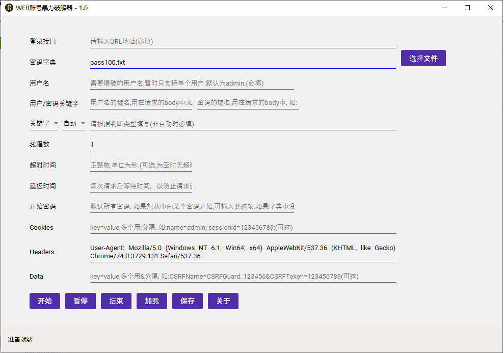

## 简介

[WebCracker](https://github.com/zgjx6/WebCracker)是一款基于C#的web后台弱口令爆破、检测工具。

使用本工具需要对http有基础了解，需要先手动抓包得到登录接口、用户名及密码的键名。

支持多线程、超时时间设置、Cookies、Headers、Data等参数设置。

目前只支持字典模式，但是可以从中间某个密码开始，也可以暂停、保存、加载。

登录成功判断暂时只支持关键字模式。

部分灵感来源于`burpsuite`及https://github.com/yzddmr6/WebCrack。




## 使用说明

本工具不支持验证码.

在 https://github.com/zgjx6/WebCracker releases 中下载中下载最新版本，其中免安装版本为rar自解压程序，执行后文件将自动解压到临时目录然后执行，也可以将其后缀改为rar然后解压执行`WebCracker.exe`即可。

## 性能测试

发包方式采用本工具、python-requests、burpsuite三种；

后端采用python-flask、python-sanic、nodejs-express、phpstudy-apache-php三种;

主要测试点还包括网络延迟、线程数、密码数。

代码如下：

python-flask：

```python
# pip install flask
from flask import Flask, request
app = Flask(__name__)
@app.route('/', methods=["POST"])
def post():
    username = request.form['username']
    password = request.form['password']
    # time.sleep(0.01)  # 模拟延迟
    if username=='admin' and password=='Test@123':
        return "登录成功"
    else:
        return "登录失败"
if __name__ == "__main__":
    app.run(debug=True)
```

python-sanic:

```python
# pip install sanic
# sanic是python的异步web框架，仅支持python3.6+，用于对比nodejs
from sanic import Sanic
from sanic.response import text
app = Sanic(__name__)
@app.route("/", methods=['POST'])
async def test(request):
    username = request.form.get('username',"")
    password = request.form.get('password',"")
    if username=='admin' and password=='Test@123':
        return text("登录成功")
    else:
        return text("登录失败")
app.run(host="127.0.0.1", port=8082, debug=False)# 必须为false，否则慢很多
```

nodejs-express：

```js
//npm install express -s
var express = require('express');
var app = express();
var bodyParser = require('body-parser');
var urlencodedParser = bodyParser.urlencoded({ extended: false })
app.post('/', urlencodedParser, function (req, res) {
    if (req.body.username=="admin"&&req.body.password=="Test@123"){
        res.send('登录成功');
    }else{
        res.send('登录失败');
    }
})
app.listen(8081, () => {})
```

phpstudy-apache-php:

```php
<?php
$username = $_POST['username'];
$password = $_POST['password'];
if ($username=='admin'&&$password=='Test@123'){
    echo "登录成功";
}else{
    echo "登录失败";
}
?>
```

python-requests 发包代码：

```python
import requests
import datetime
import os
start = datetime.datetime.now()  
url = 'http://127.0.0.1:5000'
with open('pass10k.txt', 'r', encoding="utf-8") as f:
    passwords = [i.strip() for i in f.readlines()]
data = {
    "username": "admin",
    "password": ""
}
session = requests.session()
for password in passwords:
    data['password'] = password
    res = session.post(url, data=data)
    if res.text == '登录成功':
        end = datetime.datetime.now()
        print(end-start)
        break
```


结果如下：

| 发包工具         | 后台   | 网络   | 线程数 | 密码数 | 耗时(s) |
| ---------------- | ------ | ------ | ------ | ------ | ------- |
| C#               | flask  | 无延迟 | 1      | 10k    | 25      |
| C#               | nodejs | 无延迟 | 1      | 10k    | 11      |
| C#               | php    | 无延迟 | 1      | 10k    | 51      |
| C#               | sanic  | 无延迟 | 1      | 10k    | 10      |
| C#               | flask  | 无延迟 | 8      | 10k    | 17      |
| C#               | flask  | 无延迟 | 16     | 10k    | 15      |
| C#               | flask  | 无延迟 | 64     | 10k    | 12      |
| C#               | flask  | 0.01s  | 1      | 10k    | 137     |
| C#               | flask  | 0.01s  | 16     | 10k    | 21      |
| C#               | flask  | 0.01s  | 64     | 10k    | 13      |
| C#               | flask  | 无延迟 | 16     | 100k   | 172     |
| C#               | nodejs | 无延迟 | 16     | 100k   | 25      |
| C#               | sanic  | 无延迟 | 16     | 100k   | 57      |
| python3-requests | flask  | 无延迟 | 1      | 10k    | 33      |
| python3-requests | nodejs | 无延迟 | 1      | 10k    | 18      |
| Burpsuite        | flask  | 无延迟 | 1      | 10k    | 134     |
| Burpsuite        | flask  | 无延迟 | 64     | 10k    | 114     |
| Burpsuite        | nodejs | 无延迟 | 1      | 10k    | 113     |
| Burpsuite        | nodejs | 无延迟 | 64     | 10k    | 90      |

结论：

发包速度：c#>python>>Burpsuite，本工具发包速度很快，在有网络延迟时多线程优势明显，而Burpsuite虽然功能强大，但发包速度则过慢。

响应速度：nodejs-express>python-sanic>>python-flask>>php，nodejs太强大，而php则太慢，另外还发现php每隔几秒就会明显卡顿一会儿，性能太差。


更多测试可参考[常见语言及工具发包速度对比测试](https://zgjx6.github.io/2019/10/18/%E5%B8%B8%E8%A7%81%E8%AF%AD%E8%A8%80%E5%8F%8A%E5%B7%A5%E5%85%B7%E5%8F%91%E5%8C%85%E9%80%9F%E5%BA%A6%E5%AF%B9%E6%AF%94%E6%B5%8B%E8%AF%95/)。


## 开发

本工具为C#练手项目，大部分功能其实burpsuite都有，不过本工具使用起来更加简便。

本工具为使用C#开发的WPF应用，基于.net4.7.2版本，代码开源于 https://github.com/zgjx6/WebCracker, 为防止植入木马，请在 https://github.com/zgjx6/WebCracker 上下载最新版本。

依赖：在VS菜单-工具-NuGet包管理器中安装`MaterialDesignThemes`及`ShowMeTheXAML.MSBuild`。可参考 https://github.com/MaterialDesignInXAML/MaterialDesignInXamlToolkit .


## 更新日志

| 日期       | 版本  | 说明                                                         |
| ---------- | ----- | ------------------------------------------------------------ |
| 2019-09-28 | 1.0   | 支持基本功能.                                                |
| 2019-10-18 | 1.0.1 | 修复异常返回导致崩溃的bug；<br />修复保存配置无法新建文件的bug；<br />对发送数据进行url编码。 |


## TODO

优先级：1-最高，9-最低

| 优先级 | 功能                    |
| ------ | ----------------------- |
| 5      | 多用户扫描              |
| 6      | 自动解析用户/密码关键字 |
| 7      | 账号密码支持加密算法    |
| 8      | 多种认证方式            |
| 9      | 可选项折叠              |
| 9      | 集成dirmap              |
| 9      | 请求方式添加GET         |
| 9      | 添加代理                |


## 警告！

**请勿用于非法用途！否则自行承担一切后果**


## 开源协议

[MIT License.](https://opensource.org/licenses/MIT)